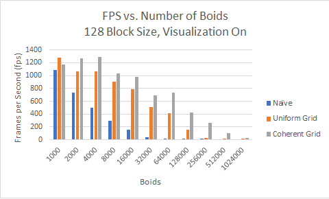
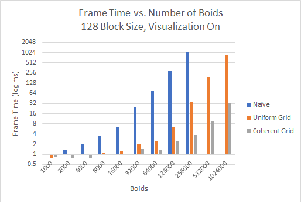
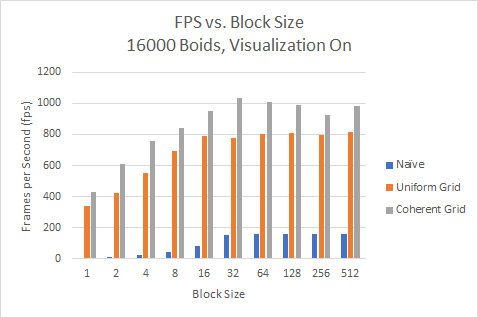
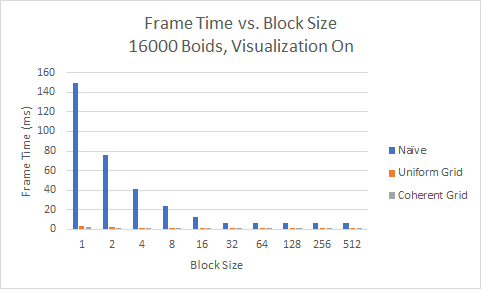
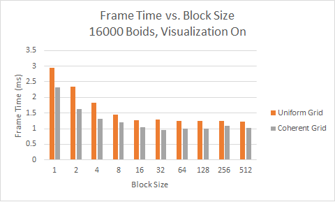

**University of Pennsylvania, CIS 565: GPU Programming and Architecture,
Project 1 - Flocking**

* Alexander Chan
* Tested on: Windows 10 Version 1803, i7-5820k @ 3.70 GHz 16GB, GTX 1080 @ 1620 MHz 8GB (Personal Computer)

### README

## Performance Analysis

Increasing the number of boids (past a certain point) decreases the frame rate.It's pretty apparent that the naive algorithm performs much worse than the uniform and coherent grid methods, dropping fps much faster than either. We can also see the performance inprovements that the coherent grid method provides, especially when the number of boids gets extremely high (at 256,000 boids, the uniform grid is no longer above 60fps, while the coherent grid stays above 60 fps even at 512,000 boids). At a small number of boids (\~1000), the performance between the three methods is very close, with uniform grid actually beating out the coherent grid, likely due to the fact that the coherent grid requires more time preprocessing. With such a small number of boids, this extra time isn't quite worth it.

Here's a graph of frame times, which provides a much better sense of the performance differences. Note that the frame time is in log_2 ms.

Beginning at 32,000 boids, we can see the coherent grid method has a 100% faster frame time than the uniform grid method. This only increases as we increase the number of boids.

Here's a plot of fps versus block size. Performance is roughly the same for 32 and up, likely due to the warp size being 32. There is almost a 1 to 1 relationship between block size and fps for the naive method. Here's the same data, plotting frame time instead.

This really shows how doubling the block size halves the frame time for the naive implementation (until 32, that is).

Here's the same data without the naive implementation, to show the differences between the uniform and coherent grid implementations. The performance increase is not that great compared to the naive implementation - going from 1 thread to 8 only halves the frame time (uniform grid).

## Questions
- For each implementation, how does changing the number of boids affect performance? Why do you think this is?

Increasing the number of boids reduces performance - this is obvious due to there being more information to compute. However, the naive implementation becomes slower much faster - this is likely due to the O(n^2) nature of the algorithm - that is, for each boid, check every other boid. The coherent grid has a much faster frame time than the uniform grid, which is very apparent as the number of boids grows, likely due to the speed (or lack thereof) of accessing memory that is not nearby.

- For each implementation, how does changing the block count and block size affect performance? Why do you think this is?

With a smaller block size, there are less boids being processed at any given time, and so more time is required to process all the boids in the simulation. However, as 32 is the size of a warp, we see no performance increase from increasing the block size past 32 (we can't schedule more than 32 threads at a time).

- For the coherent uniform grid: did you experience any performance improvements with the more coherent uniform grid? Was this the outcome you expected? Why or why not?

Yes - there were massive improvements, especially as the number of boids increased. I was not expected with how much of an improvement there was, but with a large enough number of boids, the performance improvement makes sense as there is much less wasted time for cache misses.

- Did changing cell width and checking 27 vs 8 neighboring cells affect performance? Why or why not? Be careful: it is insufficient (and possibly incorrect) to say that 27-cell is slower simply because there are more cells to check!

Decreasing the cell width does reduce performance. While there are more cells to check, each cell has fewer boids. However, the more cells to check adds more incoherent memory access, adding more overhead than just accessing boid position and velocity.